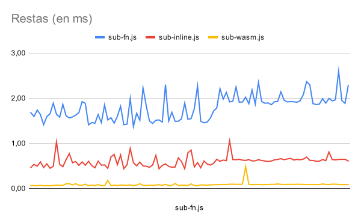
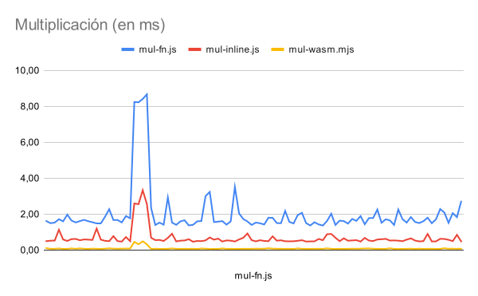
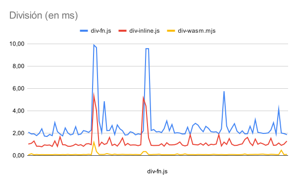

# Sumas

## Español 

Este código realiza 2048 operaciones utilizando diferentes métodos:

- `inline`: el bucle se encuentra dentro del contexto principal del programa.
- `fn`: el bucle se encuentra dentro de una función `compute`.
- `wasm`: el bucle se encuentra dentro de un módulo de WebAssembly.

Para obtener los resultados sólo es necesario correr `run.sh`.

Los resultados se guardan en `${op}-time.csv` y aquí hay varias gráfica mostrando
la comparación de 100 ejecuciones usando diferentes métodos:

## English

This code performs 2048 operations using different methods:

- `inline`: the loop is inside the main context of the program.
- `fn`: the loop is inside a `compute` function.
- `wasm`: the loop is inside a WebAssembly module.

To obtain the results it is only necessary to run `run.sh`.

The results are saved in `${op}-time.csv` and here are multiple graphs showing a
comparison of 100 executions of different methods:

Made with :heart: by [AzazelN28](https://github.com/azazeln28)
