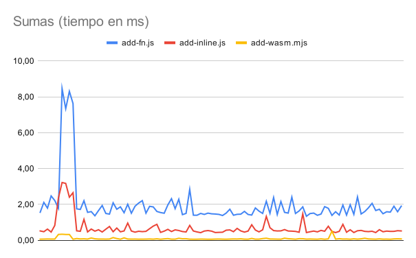

# Sumas

Este código realiza 2048 sumas utilizando diferentes métodos:

- `inline`: el bucle se encuentra dentro del contexto principal del programa.
- `fn`: el bucle se encuentra dentro de una función `compute`.
- `wasm`: el bucle se encuentra dentro de un módulo de WebAssembly.

Para obtener los resultados sólo es necesario correr `run.sh`.

Los resultados se guardan en `time.csv` y aquí hay una gráfica comparando 100
ejecuciones de los diferentes métodos:

Made with :heart: by [AzazelN28](https://github.com/azazeln28)
